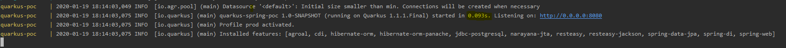

# quarkus-spring-poc project

This project uses Quarkus, the Supersonic Subatomic Java Framework.

If you want to learn more about Quarkus, please visit its website: https://quarkus.io/ .

## Running the application in dev mode

You can run your application in dev mode that enables live coding using:
```
./mvnw quarkus:dev
```

## Packaging and running the application

The application is packageable using `./mvnw package`.
It produces the executable `quarkus-spring-poc-1.0-SNAPSHOT-runner.jar` file in `/target` directory.
Be aware that it’s not an _über-jar_ as the dependencies are copied into the `target/lib` directory.

The application is now runnable using `java -jar target/quarkus-spring-poc-1.0-SNAPSHOT-runner.jar`.


## Creating a native executable with docker
1. Prepare the native artifact (linux x64)`./mvnw package -Pnative -Dquarkus.native.container-build=true`
(this will take some time... AOT compilation is resource intensive (cca 4 minutes on my PC))
2. Build image `docker build -f src/main/docker/Dockerfile.native -t quarkus/quarkus-spring-poc . `

3. Run the container `docker run -i --rm -p 8080:8080 --name quarkus-spring-poc quarkus/quarkus-spring-poc`

If you want to learn more about building native executables, please consult https://quarkus.io/guides/building-native-image-guide .

## Run app with docker-compose
make sure you have the jar or native artifact prepared with mvn
Build image `docker-compose build`

Run stack`docker-compose up`

##Native image stats
The startup time is under 100ms (native image). In that time the application boots up and makes connection to postgres database.
The memory consumption is 9MB. The memory consumption was measured with `docker stats`.


